# SQL Project Greencycles Online Movie Rental Shop Data Analysis Using PostgreSQL

## Project Description

**Problem :**  
**Inventory Management**  
Ensuring the availability of popular movies and managing inventory effectively

**Challenges :**  
Help the company operate big query and gain insight from data.

## Project Goal

Optimize the movie catalog by identifying and promoting popular content, while efficiently managing licensing costs to maximize profitability

## Tools & Library Used

 &nbsp;

## Project Result

[Click here to get full code](https://github.com/nickenshidqia/Online_Movie_Rental_Shop_Data_Analysis_SQL_Project/blob/9ab5a4d2b8f69a7341c924b5952b23026e0bfff8/SQL%20Project%20Greencycle%20Movie%20Rental%20Company.sql)

## Query Task

1. In the email system there was a problem with names where either the first name or the last name is more than 10 characters long. Find these customers and output the list of these first and last names in all lower case  
   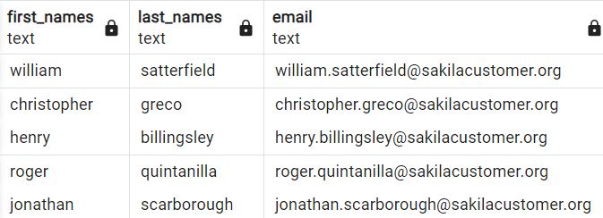
2. Extract the last 5 characters of the email address first. The email address always ends with '.org’. How can you extract just the dot '.' from the email address?  
   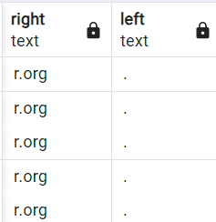
3. You need to create an anonymized version of the email addresses. It should be the first character followed by '\*\*\*' and then the last part starting with '@'.  
   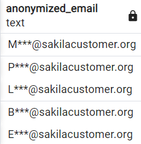
4. In this challenge you have only the email address and the last name of the customers. You need to extract the first name from the email address and concatenate it with the last name. It should be in the form: "Last name, First name".
   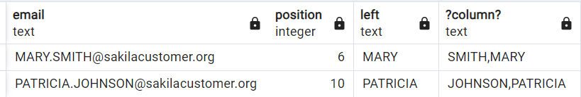
5. You need to create an anonymized form of the email addresses  
   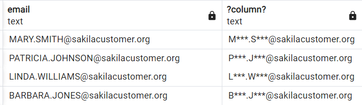
6. What's the highest amount one customer has spent in a week?  
   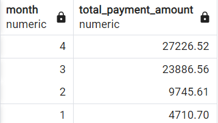
7. You need to sum payments and group in the following formats  
   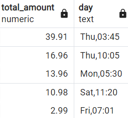
8. You need to create a list for the suppcity team of all rental
   durations of customer with customer_id 35. Also you need to find out for the suppcity team which customer has the longest average rental duration?  
   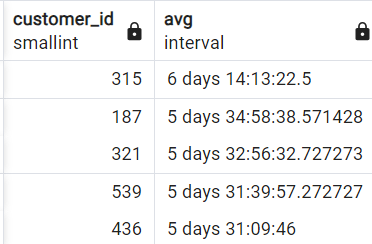
9. Your manager is thinking about increasing the prices for films that are more expensive to replace. Create a list of the films including the relation of rental rate where the rental rate is less than 4% of the replacement cost.  
   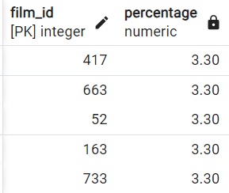
10. a. Rating is 'PG' or 'PG-13' or length is more then 210 min: 'Great rating or long (tier 1)
    b. Description contains 'Drama' and length is more than 90min: 'Long drama (tier 2)’
    c. Description contains 'Drama' and length is not more than 90min: 'Shcity drama (tier 3)’
    d. Rental_rate less than $1: 'Very cheap (tier 4)’
    How can you filter to only those movies that appear in one of these 4 tiers?  
     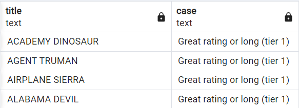
11. sum rating by category but in pivot table  
    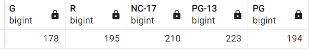
12. Handling missing value in return_date from rental table with 'Not returned'  
    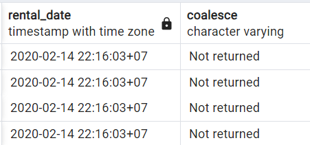
13. The company wants to run a phone call campaing on all customers in Texas (=district). What are the customers (first_name, last_name, phone number and their district) from Texas?  
    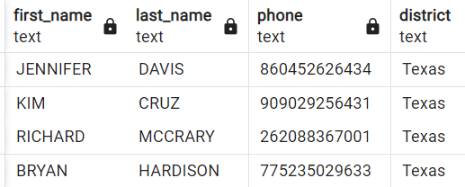
14. The company wants customize their campaigns to customers depending on the country they are from.
    Which customers are from Brazil?  
     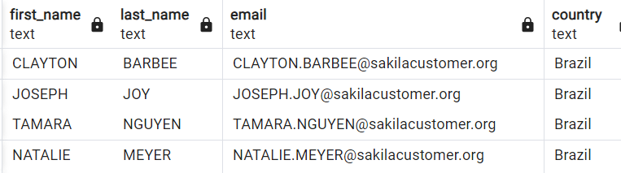
15. Which title has GEORGE LINTON rented the most often?  
    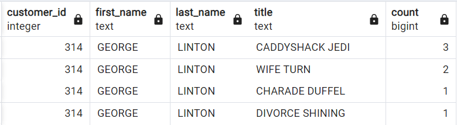
16. Select all of the films where the length is longer than the average of all films  
    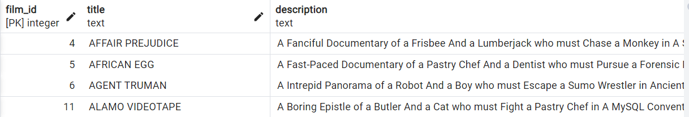
17. Return all the films that are available un the inventory in store 2 more than 3 times  
    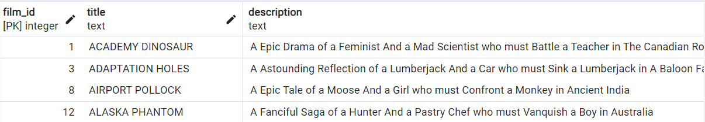
18. Return all customer first names and last names
    that have made payment on 2020-01-25  
     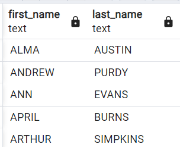
19. Return all customer first name and email address that have spent a more than $30  
    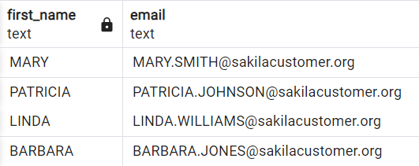
20. Return all the customer first and last name
    that are from California and have spent more than
    100 in total  
     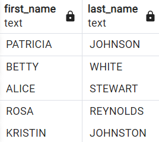
21. What is the average total amount spent per day (average daily revenue)?  
    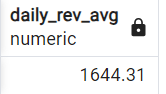
22. Show all the payment together with how much the payment amount is below the maximum payment amount  
    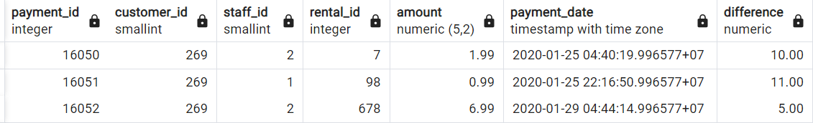
23. Show only those movie titles, their associated film_id and replacement \_cost with the lowest replacement \_cost for in each rating category - also show the rating  
    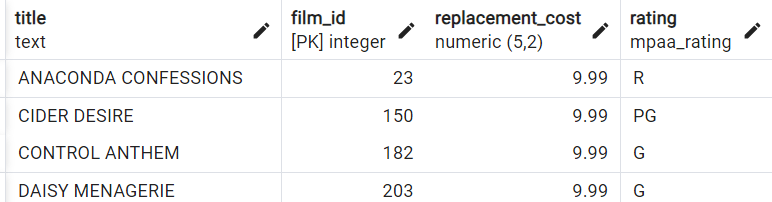
24. Show only those movie titles, their associated film_id
    and the length that have the highest length in each
    category - also show the rating  
     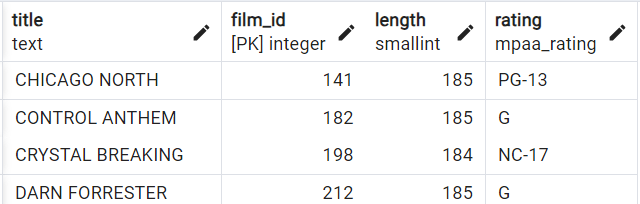
25. Show all the payments plus the total amount for every customer as well as the number of payments of each customer  
    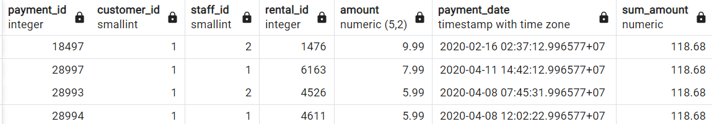
26. Show only those films with the highest replacement costs in their rating category plus show the average replacement cost in their rating category  
    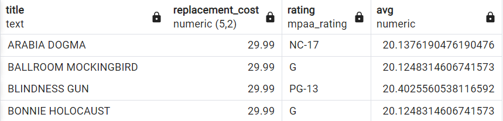
27. Show only those payments with the highest payment for each customer's first name - including the payment_id of that payment. How would you solve it if you would not need to see the payment_id?  
    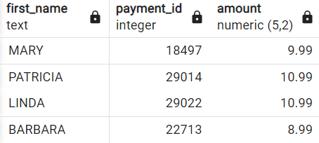
28. Create a list of all the different (distinct) replacement costs of the films. What's the lowest replacement cost?  
    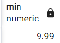
29. Write a query that gives an overview of how many films have replacements costs in the following cost ranges
    low: 9.99 - 19.99
    medium: 20.00 - 24.99
    high: 25.00 - 29.99
    How many films have a replacement cost in the "low“ group?  
     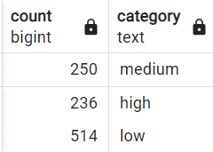
30. Create a list of the film titles including their title, length, and category name ordered descendingly by length. Filter the results to only the movies in the category 'Drama' or 'Sports’. In which category is the longest film and how long is it?  
    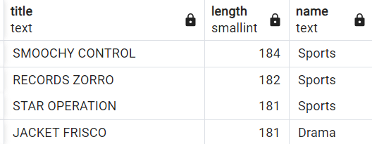
31. Create an overview of how many movies (titles) there are in each category (name). Which category (name) is the most common among the films?  
    
32. Create an overview of the actors' first and last names and in
    how many movies they appear in. Which actor is part of most movies?  
     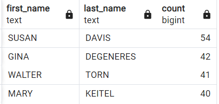
33. Create an overview of the addresses that are not associated
    to any customer How many addresses are that?  
     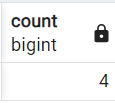
34. Create an overview of the cities and how much sales (sum of amount) have occurred there. Which city has the most sales?  
    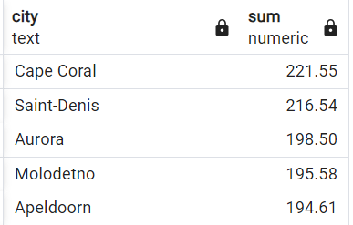
35. Create an overview of the revenue (sum of amount) grouped by a column in the format "country, city". Which country, city has the least sales?  
    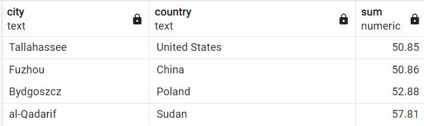
36. Create a list with the average of the sales amount each staff_id has per customer. Which staff_id makes on average more revenue per customer?  
    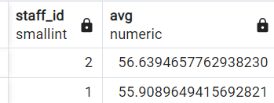
37. Create a query that shows average daily revenue of all Sundays. What is the daily average revenue of all Sundays?  
    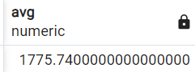
38. Create a list of movies - with their length and their replacement cost - that are longer than the average length in each replacement cost group. Which two movies are the shortest on that list and how long are they?  
    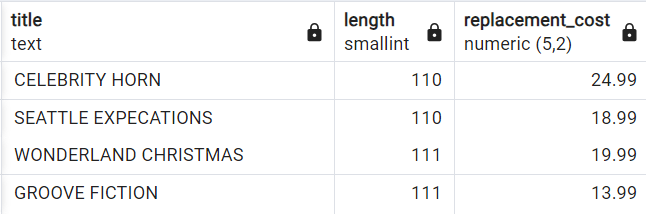
39. Create a list that shows the "average customer lifetime value" grouped by the different districts.  
    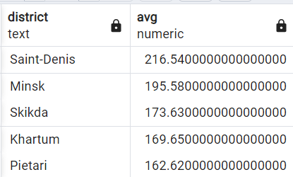
40. Write a query that returns the list of movies including film_id,, title, length, category, average length of movies in that category. Order the results by film_id.  
    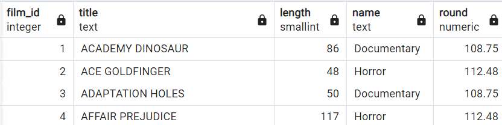
41. Write a query that returns all payment details including the number of payments that were made by this customer and that amount  
    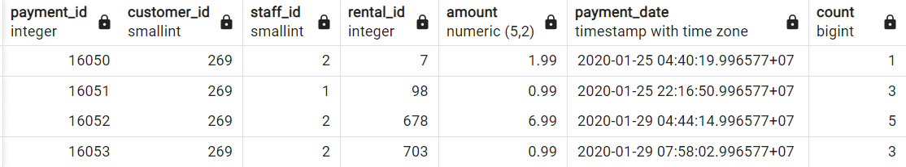
42. Rank number one position every film category  
    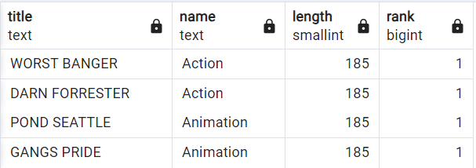
43. Write a query that returns the customers' name, the country and how many payments they have. For that use the existing view customer_list. Afterwards create a ranking of the top customers with most sales for each
    country. Filter the results to only the top 3 customers per country  
     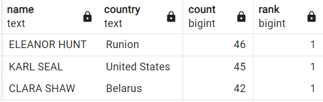
44. Write a query that returns the revenue of the day and the revenue of the previous day. Afterwards calculate also the percentage growth compared to the previous
    day  
     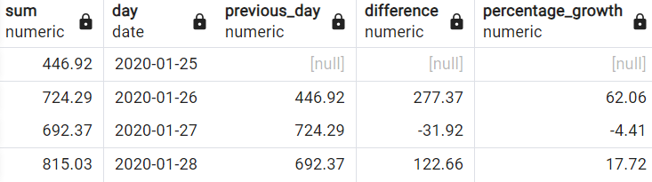
45. Write query that return the sum of the amount for each customer (first name and last name) and each staff_id. Also add the overall revenue per customer  
    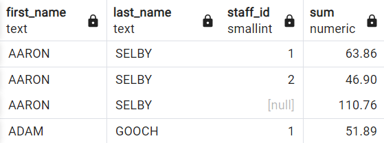
46. Write a query that calculates now the share of revenue
    each staff_id makes per customer  
     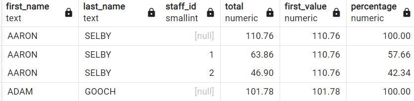
47. Write a query that returns all grouping sets in all
    combinations of customer_id, date and title with the aggregation of the payment amount.  
     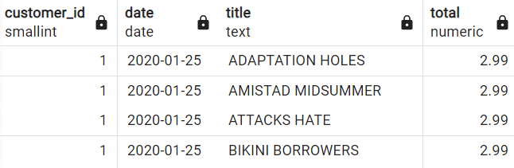
